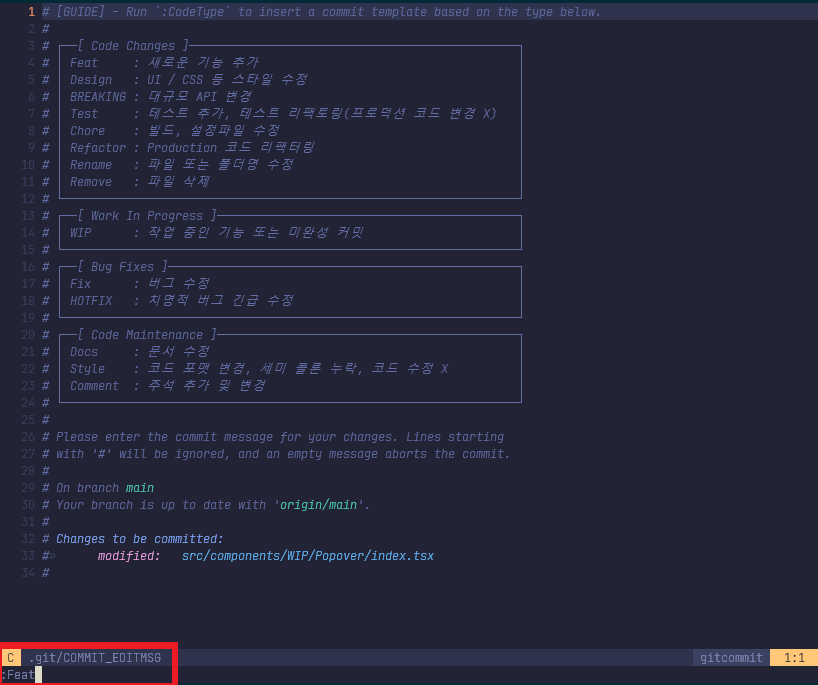
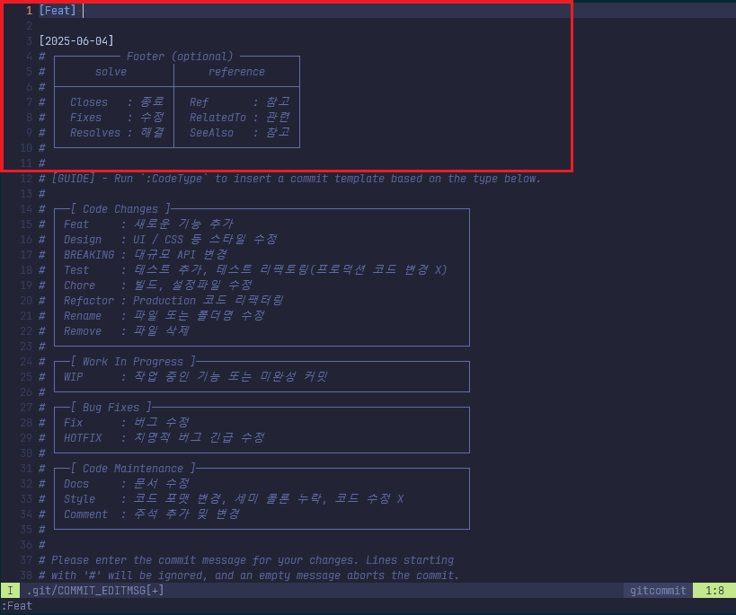
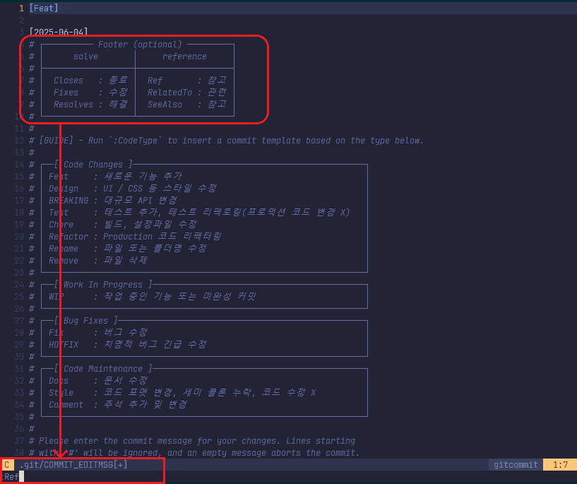
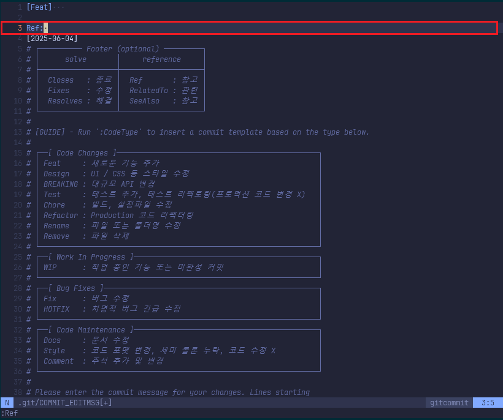

# git commit template

git 커밋시 메세지 항상 일관되게 함으로써 파악하기 쉽게한다.

#### 메세지 종류
<table>
    <tr>
        <td colspan=2 style='text-align:center; font-weight:bold;'>code changes</td> 
    </tr>
    <tr>
        <td style='font-weight:500; text-align:center;'>command</td>
        <td style='font-weight:500; text-align:center;'>description</td>
    </tr>
    <tr>
        <td>:Feat</td>
        <td>새로운 기능 추가</td>
    </tr>
    <tr>
        <td>:Chore</td>
        <td>빌드, 설정파일 수정</td>
    </tr>
    <tr>
        <td>:BREAKING</td>
        <td>대규모 API 변경</td>
    </tr>
    <tr>
        <td>:Refactor </td>
        <td>Production 코드 리팩토링</td>
    </tr>
    <tr>
        <td>:Test</td>
        <td>테스트 추가, 테스트 리팩토링</td>
    </tr>
    <tr>
        <td>:Desing</td>
        <td>UI / CSS 스타일 수정</td>
    </tr>
    <tr>
        <td>:Rename</td>
        <td>파일 or 폴더명 수정</td>
    </tr>
    <tr>
        <td>:Remove</td>
        <td>파일 or 폴더 삭제</td>
    </tr>
    <tr>
        <td colspan=2>
        </td>
    </tr>
    <tr>
        <td colspan=2 style='text-align:center; font-weight:bold;'>Work In Progress</td> 
    </tr>
    <tr>
        <td style='font-weight:500; text-align:center;'>command</td>
        <td style='font-weight:500; text-align:center;'>description</td>
    </tr>
    <tr>
        <td>:WIP</td>
        <td>작업 중인 기능 or 미완성 커밋</td>
    <tr>
        <td colspan=2>
        </td>
    </tr>
    </tr>
        <tr>
        <td colspan=2 style='text-align:center; font-weight:bold;'>Bug Fix</td> 
    </tr>
    <tr>
        <td style='font-weight:500; text-align:center;'>command</td>
        <td style='font-weight:500; text-align:center;'>description</td>
    </tr>
    <tr>
        <td>:Fix</td>
        <td>버그수정</td>
    </tr>
    <tr>
        <td>:HOTFIX</td>
        <td>치명적 버그 수정</td>
    </tr>
    <tr>
        <td colspan=2>
        </td>
    </tr>
    <tr>
        <td colspan=2 style='text-align:center; font-weight:bold;'>code maintanence</td> 
    </tr>
    <tr>
        <td style='font-weight:500; text-align:center;'>command</td>
        <td style='font-weight:500; text-align:center;'>description</td>
    </tr>    
    <tr>
        <td>:Docs</td>
        <td>문서수정</td>
    </tr>
    <tr>
        <td>:Style</td>
        <td>코드 포맷, 세미콜론 누락 등</td>
    </tr>
    <tr>
        <td>:Comment</td>
        <td>주석 추가 및 변경</td>
    </tr>

</table>


```
:Feat
```



```
:Ref
```


